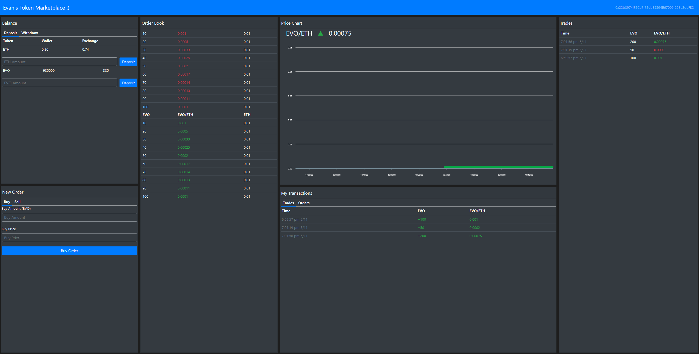

# Table of Contents

- [Title](#SocialMediaApp)
- [Motivation](#Motivation)
- [Images](#Images)
- [Live-Link](#Live-Link)
- [Skills-Used](#Skills-Used)
- [Description](#Description)
- [License](#License)

# EVO-Marketplace

# Motivation

I wanted to further my understanding of building a DAPP with an emphasis on Solidity and Chai. This project introduced me to Redux along the way and its way of handling states and interactions. As a user you are able to buy and sell my EVO coin with Ethereum on the Ropsten test network.

# Images

</img>

- Home Page

# Live-Link

[https://eth-marketplace.herokuapp.com/](https://eth-marketplace.herokuapp.com/)

# Skills-Used

- Intergrating Metamask into my DAPP.
- Create, Delete, Trade, Deposit and Withdrawl my EVO tokens.
- Construct Exchange and Token Smart Contracts using the Solidity language.
- Redux state managament and interactions.
- React front-end displaying information from a Solidity Smart Contract

# Description

The app uses the following technologies:

- [React](https://reactjs.org/) is used to run the application.
- [Solidity](https://soliditylang.org/) is used to create the Smart Contracts.
- [Truffle](https://www.trufflesuite.com/) is used to provide a local test blockchain.
- [Chai](https://www.chaijs.com/) is used for the testing of smart contracts.
- [Redux](https://redux.js.org/) is used to handle state management throught the application.

# License

